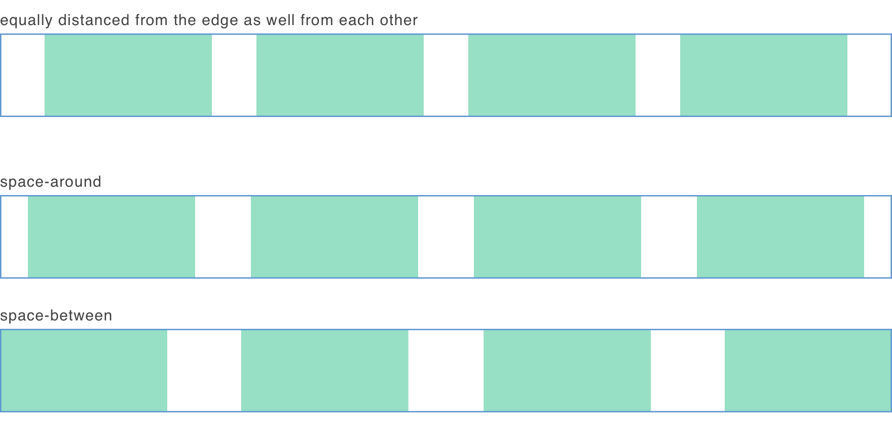

+++
title = "Flex justify content equally distanced items"
aliases = ["/flex-justify-content-equally-distanced-items/"]
category = ["CSS/SASS"]
tags = ["css","flex"]
comments = [
  "comments/flex-justify-content-equally-distanced-items/1536327731710.json"
]
image = "./flex-justify-content.png"

+++


I want to share a hack (or a trick if you prefer) my colleague Marko showed me today.

What is the problem? We want our flex items to be equally distanced between each other and from the parent's edge. Unforunately
<Sidenote note="I wasn't aware of this property, thank you Marc for mentioning it in the comment below.">`space-evenly`</Sidenote>
is [not supported in IE and Edge](https://caniuse.com/#search=space-evenly). And `space-around` or `space-between` won't work.

You can see what we are trying to achieve in the first row, and how the latter two are behaving.




Trick is really simple, use `space-between` and add empty pseudo elements (`::before` and `::after`) to the parent element. Pseudo elements have no width, but they are still "pushing" real elements from themselves.

```scss
.wrapper {
  display: flex;
  justify-content: space-between;
}

.wrapper::before,
.wrapper::after {
  content: '';
}
```

This hack works with dynamic number of elements, dynamic widths and for any flex direction.

You can see it in the action below:


<Codepen id={"XPzmqg"} title={"Flex items equally distanced from each other, as well from the parent's edge"} height={400} />
