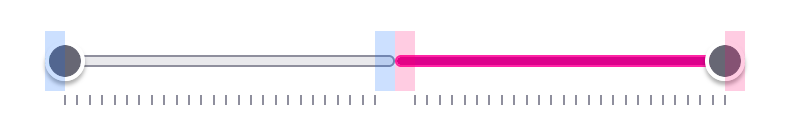
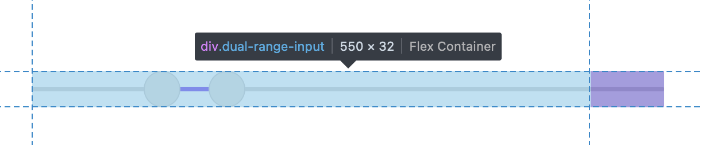

+++
title = "Native <span>dual-range</span> input"
category = ["JavaScript"]
tags = ["js","range","input","css"]
intro = "Two native range inputs and fifty lines of JavaScript to make them work together."
image = "./img/thumbnail.png"

+++


<link rel="stylesheet" href="/css/posts/dual-range-input.css" />

I just released [@stanko/dual-range-input](https://github.com/stanko/dual-range-input) - a native dual-range input. Here is how it looks with the default styles:

<div className="demo">
  <div className="dual-range-input">
    <input type="range" min="0" max="100" step="1" defaultValue="25" />
    <input type="range" min="0" max="100" step="1" defaultValue="75" />
  </div>
  <div className="values"></div>
</div>


The "native" part is somewhat open for discussion. I call it native because the library uses two native HTML range inputs. This means that all of the native interactions and accessibility features are preserved.

Native inputs allow us not to reinvent the wheel. There is about [fifty lines of JavaScript](https://cdn.jsdelivr.net/npm/@stanko/dual-range-input/dist/index.js) to synchronize the inputs, along with some CSS to ensure everything looks polished.

In my book, that is *native enough*.

## Why

When I create [my generative drawings](/art), I use a tool I built myself. This tool includes a UI for tweaking parameters, and I often have minimum and maximum sliders for certain parameters. I thought it would be nice to have a dual-range slider for these. However, most existing solutions rely heavily on JavaScript and reimplement dragging and accessibility features.

So, I set my own set of requirements:

- It should use native HTML range inputs.
- When you click on the track, the closer of the two thumbs should jump to that value.

Hopefully, after you read these two requirements, my solution will make sense.

## How it works

There are two inputs placed next to each other. When either of the inputs is changed, the library calculates a midpoint between the two selected values. Then the `min` and `max` attributes are set to the midpoint, and the width of both inputs is updated to match.

Here is an unstyled example, which will hopefully illustrate this well:

<div className="demo demo--blank">
  <div className="inputs">
    <input list="tickmarks" type="range" min="0" max="50" step="1" defaultValue="25" />
    <input list="tickmarks" type="range" min="0" max="50" step="1" defaultValue="75" />
  </div>
  <div className="values"></div>
  <datalist id="tickmarks">
  </datalist>
</div>

Even like this, it works reasonably well. We'll style it later to make it look nicer.

### Resizing the inputs

There's a small trick involved in calculating input widths. This is because the range input's track is actually shorter than the input's total width. All browsers leave enough space on the sides so the thumb doesn't stick out.

Here is a screenshot from Firefox (other browsers work similarly), where you can see that the track is shorter than the width. I've emphasized the space the browser leaves for the thumb.



If we take an example where the inputs need to be in a 1:3 ratio, simply setting their widths to 25% and 75% isn't enough. We also need to account for the thumb width. Instead of calculating the exact ratio, I simplified the math by adding the thumb width to each input's width:

```scss
input:first-child {
 width: calc(25% + var(--dri-thumb-width));
}

input:last-child {
 width: calc(75% + var(--dri-thumb-width));
}
```

If you thought, *Wait, this adds up to more than 100%*, you'd be 100% right. That's why I applied a small trick: I added padding to the inputs' wrapper to accommodate the extra width for the thumbs.



This makes the math simpler while keeping the input sizing correct. It took me forever to explain this properly, and I'm still not sure if I succeeded.

### Move the thumb closer to the click

Because the inputs are resized to meet at the midpoint, whenever you click between the thumbs, the one closer to the click will move to that value.

<button type="button" className="toggle-debug text-link">Toggle the debug mode <span className="hide-when-debug">on</span><span className="show-when-debug">off</span></button> and the midpoint will be easier to see.

<div className="demo demo--purple">
  <div className="dual-range-input">
    <input type="range" min="0" max="20" step="1" defaultValue="4" />
    <input type="range" min="0" max="20" step="1" defaultValue="5" />
  </div>
  <div className="values"></div>
</div>

If there's an odd number of steps between the thumbs, the last-used input is favored. Try it out with debug mode on, and you'll see what I mean.

With that, both requirements are satisfied. The only thing left is to style it properly.

## Styling

All browsers allow us to style range inputs using CSS. That made styling of the tracks and thumbs pretty straightforward. I just ensured that the tracks didn't have a border radius in the middle where they connect.

<div className="demo demo--thick-no-gradient">
  <div className="dual-range-input">
    <input type="range" min="0" max="100" step="1" defaultValue="25" />
    <input type="range" min="0" max="100" step="1" defaultValue="75" />
  </div>
  <div className="values"></div>
</div>

### Theming

I exposed several variables to make theming easier. Here's the complete list with their default values:

```scss
.dual-range-input {
  --dri-height: 1.5rem;

  --dri-thumb-width: 1.25rem;
  --dri-thumb-height: 1.25rem;

  --dri-thumb-color: #ddd;
  --dri-thumb-hover-color: #a8d5ff;
  --dri-thumb-active-color: #4eaaff;
  --dri-thumb-border-color: rgba(0, 0, 0, 0.1);
  --dri-thumb-border-radius: 1rem;

  --dri-track-height: 0.25rem;
  --dri-track-color: #ccc;
  --dri-track-filled-color: #0084ff;
  --dri-track-border-radius: 1rem;
}
```

To create your own theme, simply override these variables.

### Gradients

One thing I thought was cool is how I used CSS gradients to paint the selected range in both inputs. I set the gradients to use the `--dri-gradient-position` variable, then updated that variable in the code along with the widths.

Here's how the CSS looks for one of the inputs:

```scss
input:first-child::-moz-range-track {
  background-image: linear-gradient(
    to right,
    var(--dri-track-color) var(--dri-gradient-position),
    var(--dri-track-filled-color) var(--dri-gradient-position)
  );
}
```

Again, <button type="button" className="toggle-debug text-link">toggling the debug mode on</button> and the semi-transparent thumbs will make the gradients easier to see.

<div className="demo demo--thick">
  <div className="dual-range-input">
    <input type="range" min="0" max="100" step="1" defaultValue="25" />
    <input type="range" min="0" max="100" step="1" defaultValue="75" />
  </div>
  <div className="values"></div>
</div>

## Conclusion

I had to write this post as ~a brain dump~ a way to consolidate my thoughts, so I hope it's not too convoluted.

Thank you for following along, and I hope this inspires you to try it out and consider using more native elements before opting for custom libraries.

<script src="/js/posts/dual-range-input.js" type="module"></script>

