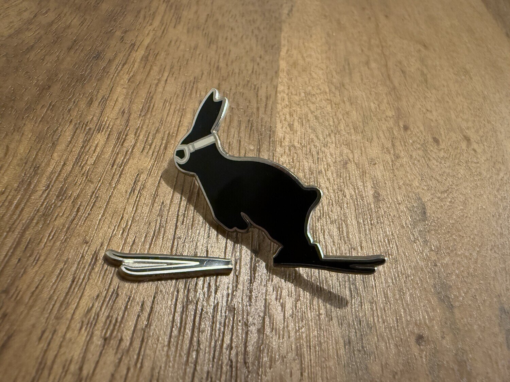
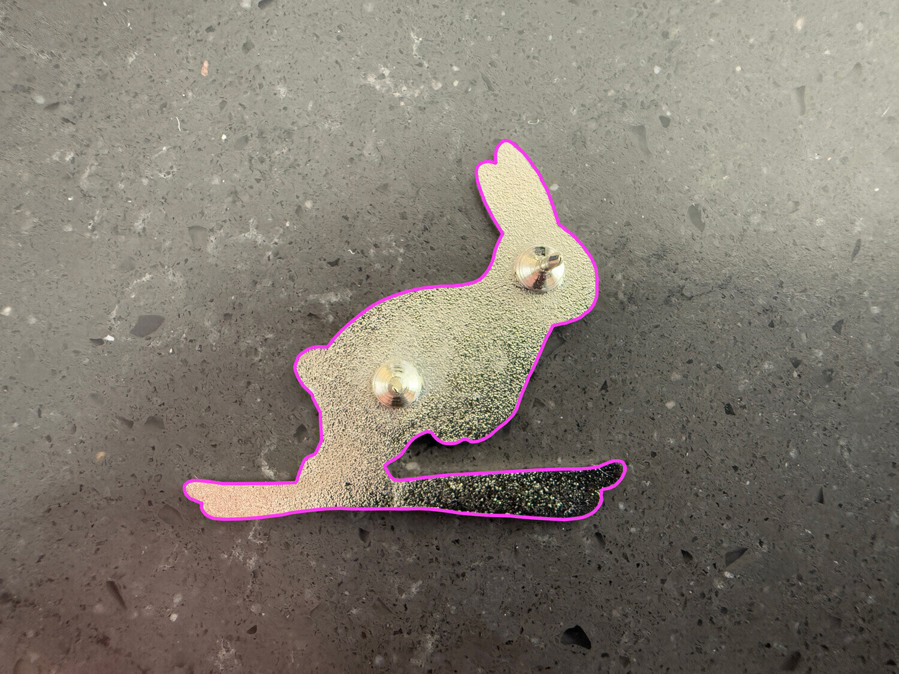
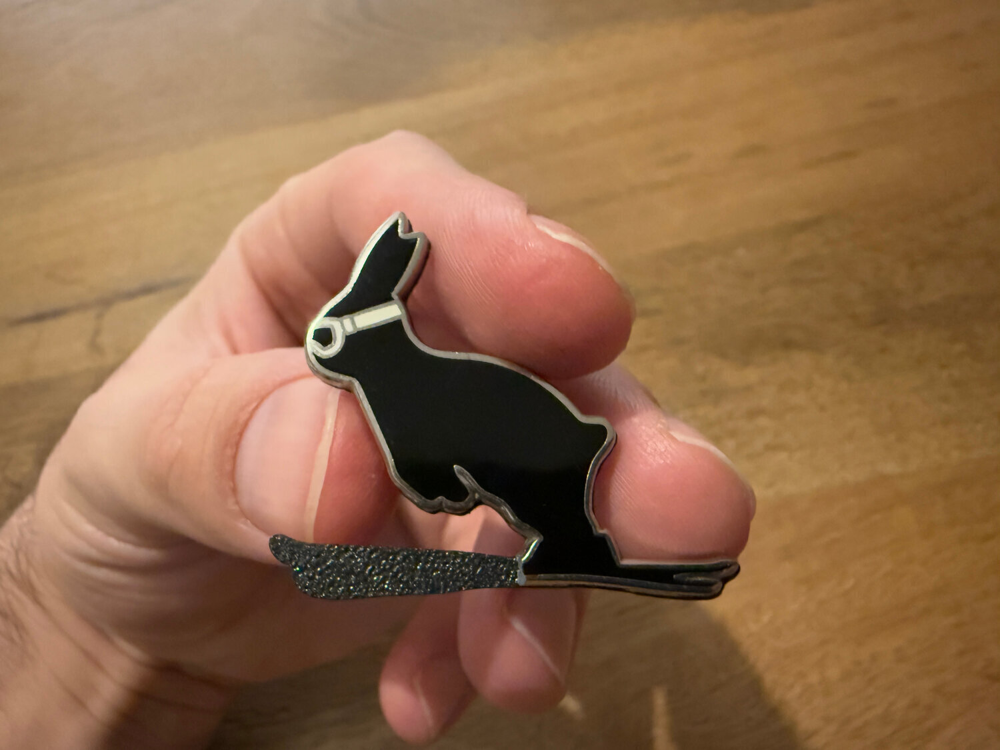
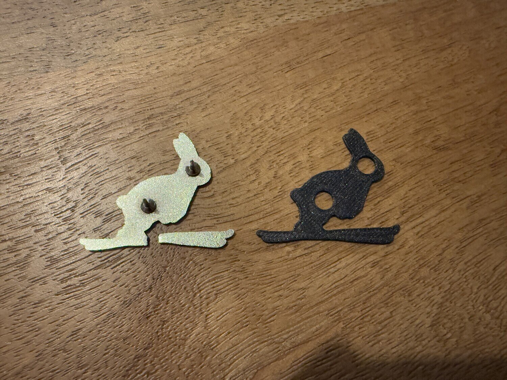
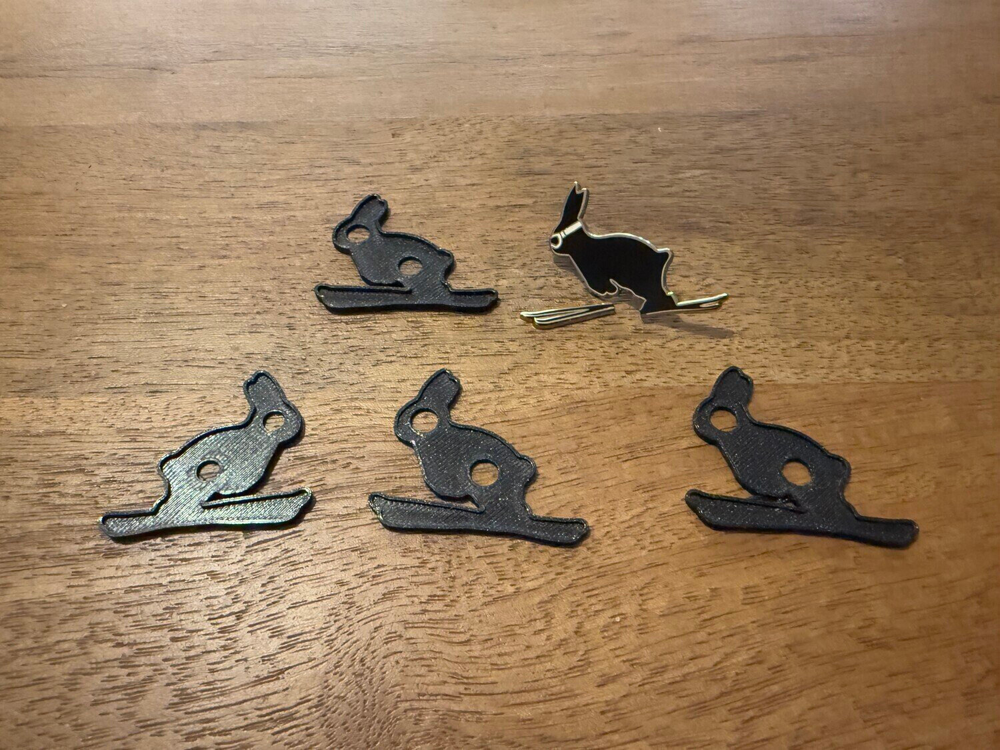
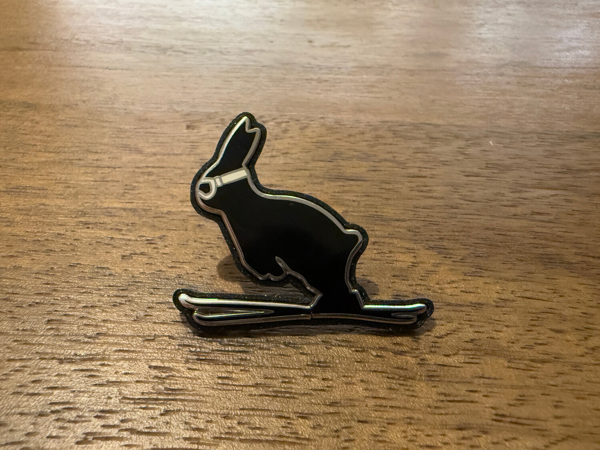
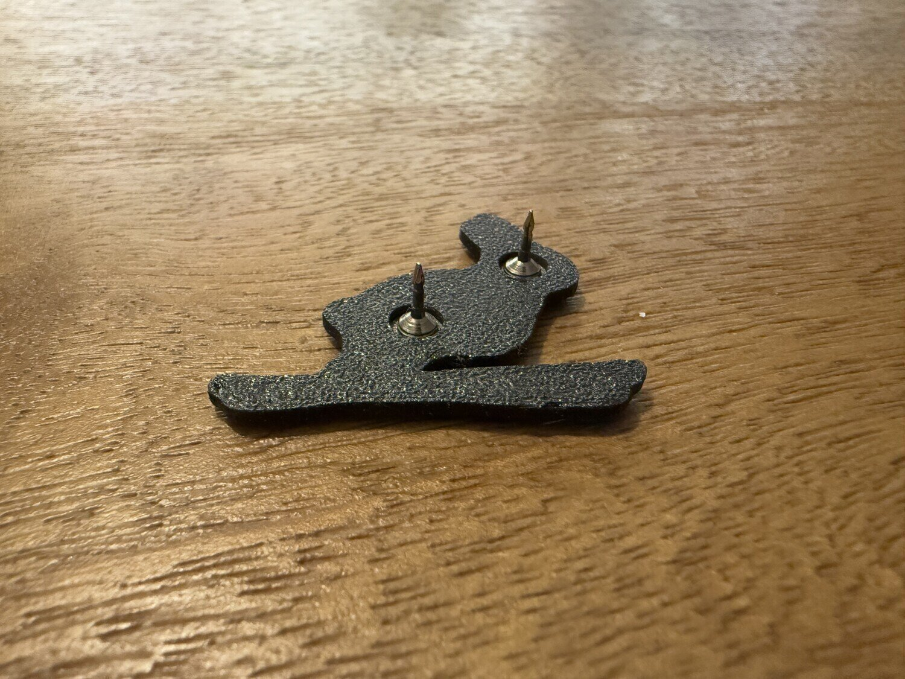

+++
title = "Bunny jumps again"

category = ["Random"]
tags = ["3d printing", "random", "bunny", "inkscape"]

intro = "My wife's favorite bunny brooch broke, and she turned to me to fix it. If you have a 3D printer at home, 3D printing is the answer."
image = "./img/bunny-jumps-again.jpg"
theme = "blue"
+++

I love 3D printing. It feels like magic - we are able to design and create physical things in a matter of hours, in our homes. I understand the underlying technology, but it still blows my mind when I think about it. It makes me a bit sad that more people aren't fascinated by it.

Let's see what my love for 3D printing has to do with bunnies. Ski jumping bunnies to be exact. My wife has a brooch that she really likes - of a bunny ski jumping. She wears it on her backpack, and when she's in the mountains, on her ski jacket. But unfortunately it broke - the skies snapped off. So she asked me, _Can you fix it somehow? Maybe 3D print something?_

This was right up my alley. After some thought, I decided the best approach would be to design a frame for the broken pieces, with slightly offset edges to keep them in place. But how could I design it when the outline was so irregular? After overthinking it, I returned to a simple solution - I took a photo of the brooch, imported it into Inkscape, and traced it by hand.

Here is the result:

I extruded the outline using [TinkerCad](https://www.tinkercad.com/) and did a test print. I was pleasantly surprised, because the print was almost perfect.

There were a few points that needed tweaking, but before making changes, I wanted to see if simply adding an edge would work. And it did! To be fair I printed four in total. I'm a bit embarrassed to admit, but I printed the first one mirrored. Then printed three more with slightly different measurements for the offset and edge height.

One of them fit perfectly. And I mean - perfectly - it is a very tight press fit.

Oh joy! Bunny bunny jumps again! My wife was thrilled to see her favorite brooch fixed.

But the real point I wanted to share is that 3D printing is amazing, and sometimes, the simplest ideas work best!
