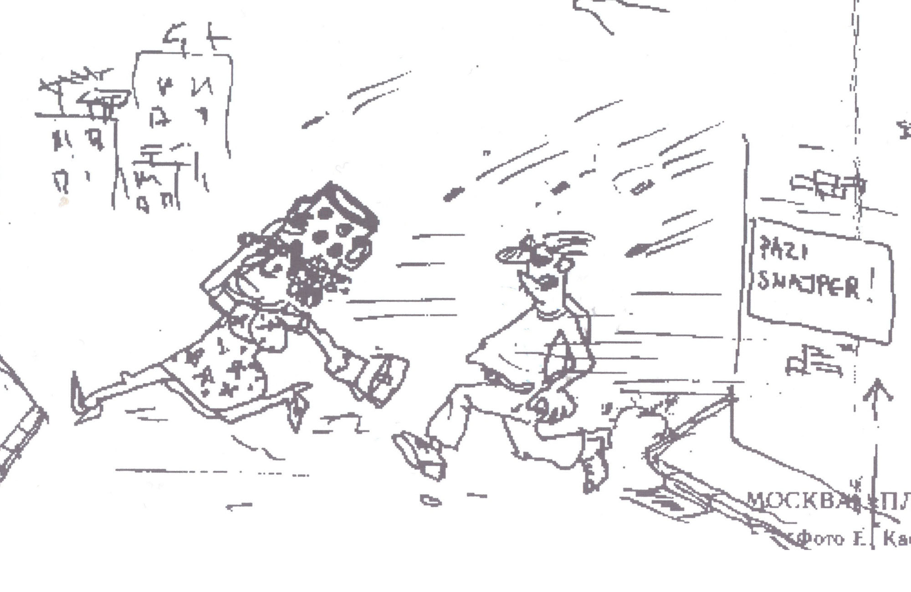
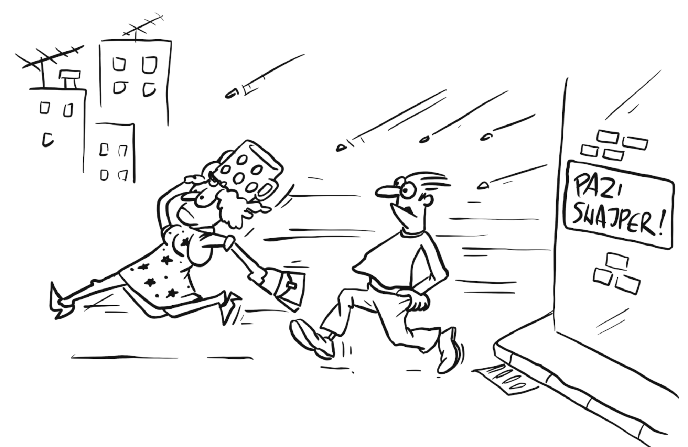
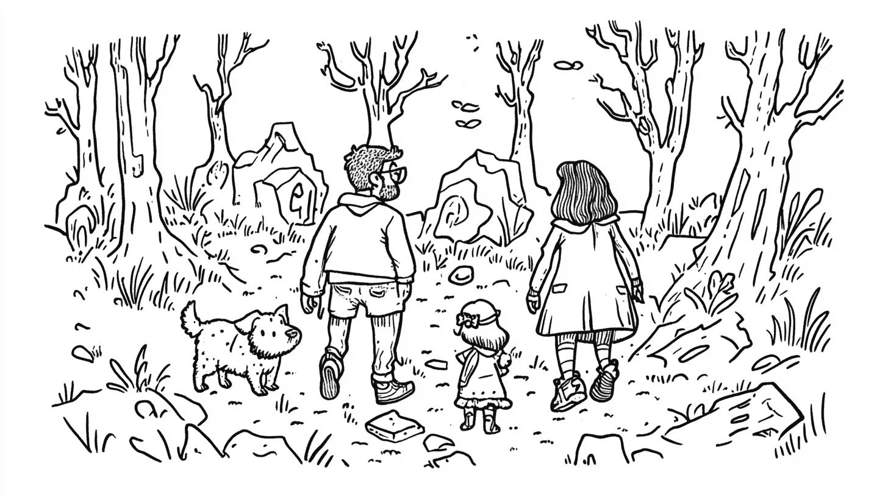
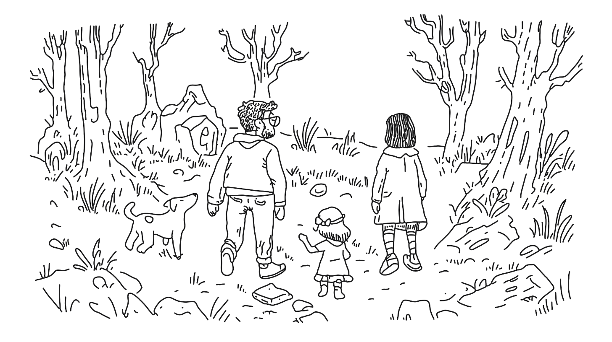

+++
title = "<span>Image comparison slider</span> in 6 lines of JavaScript"

category = ["JavaScript"]
tags = ["slider", "js", "css", "image"]

intro = "Image comparison component leveraging native HTML range input and a few lines of JavaScript."
image = "./img/thumb.jpg"
favorite = true
+++

<link rel="stylesheet" href="/css/posts/image-comparison-slider.css" />

While I was writing [this post](/blog/the-tiny-book-of-great-joys/), I wanted to create an image comparison component. I made one with just a few lines of JavaScript, but I didn't include it in the post.

Here is the finished slider, with images from the book [Letters from Sarajevo](https://lettersfromsarajevo.com/). If you want to play with the code, you can find it on [CodePen](https://codepen.io/stanko/pen/myddXKm).

<div className="compare compare--letters">
  

  <div className="compare__mask">
    
  </div>

  <input className="compare__input" type="range" min="0" step="0.5" max="100" defaultValue="50" />

  <div className="compare__separator">
    <svg xmlns="http://www.w3.org/2000/svg" fill="none" className="compare__icon" viewBox="0 0 16 16">
      <path d="M 6 2 L 1 8 L 6 14 M 10 2 L 15 8 L 10 14" stroke="currentColor" />
    </svg>
  </div>
</div>

<button className="btn btn--sm toggle-debug">Toggle debug</button>

Try out the <Sidenote note="I'm quite proud of it! The shadow effect is my favorite detail.">debug mode</Sidenote>. It reveals the structure in 3D and might give you a clue as to how I managed to create the slider with only a few lines of JavaScript.

Here's a tip - the blue element is actually a native HTML range input.

## It's in the name

Image comparison _slider_. Slider, you say? We already have a native slider component - input `[type=range]`. Could we use it to make an image comparison slider? Turns out we can.

I think that the solution I came up with is clever, yet simple to understand.

This is the base idea:

- We have two images and the range slider, stacked on each other.
- The range input goes from 0 to 100.
- As the slider is moved, we update a CSS variable to match the slider value.
- We use this variable to set the width of the top image.

Here is a simplified, unstyled example. Try moving the slider to see how it works.

<div className="unstyled">
  <pre className="unstyled__css z-code"></pre>
  <div className="unstyled__mask">
    
  </div>
  <div>
    <input className="unstyled__input" type="range" min="0" step="0.5" max="100" defaultValue="50" />
  </div>
</div>

## JavaScript

As we saw in the example above, everything is about keeping the slider value synced with the CSS variable. This variable controls the width of the top image and the position of the separator.

Here is the JavaScript code that keeps the `--slider-value` variable in sync with the slider value:

```js
// Set element variables
const compareSlider = document.querySelector('.comparison-slider');
const input = compareSlider.querySelector('.comparison-slider__input');

// Update the CSS variable on input change
input.addEventListener('input', () => {
  compareSlider.style.setProperty('--slider-value', `${input.value}%`);
});

// Update the CSS variable on load
// to ensure the slider starts in sync with image's width.
compareSlider.style.setProperty('--slider-value', `${input.value}%`);
```

We could have been cheeky and shortened this code even more, but I favor readability. The code is still super short and easy to understand.

Here is another example for good measure, this time images are from [The Tiny Book of Great Joys](/blog/the-tiny-book-of-great-joys/):

<div className="compare compare--tiny-book">
  
  <div className="compare__mask">
    
  </div>
  <input className="compare__input" type="range" min="0" step="0.5" max="100" defaultValue="50" />
  <div className="compare__separator">
    <svg xmlns="http://www.w3.org/2000/svg" fill="none" className="compare__icon" viewBox="0 0 16 16">
      <path d="M 6 2 L 1 8 L 6 14 M 10 2 L 15 8 L 10 14" stroke="currentColor"></path>
    </svg>
  </div>
</div>

<button className="btn btn--sm toggle-debug">Toggle debug</button>

## Browser support

I've tested it in Firefox, Chrome, and Safari on desktop, as well as Safari on mobile. It works smoothly in all of them. I'm pretty sure it will work on other browser too, but I haven't tested it myself.

If this post gets some traction, I'll probably clean it up and release a small library.

## Accessibility

A nice thing about using native elements is that they are accessible by default. The range input is accessible and works with keyboard and screen readers. However, we need to add labels for the range input and the component itself.

I think something like this would work well:

```html
<div
  class="comparison-slider"
  aria-label="
    Image comparison slider showing [image 1 description] and [image 2 description].
    Use the slider to compare the images."
>
  <!-- Images and separator go here -->

  <label for="comparison-slider-input" id="comparison-slider-label">
    Adjust slider to compare images
  </label>
  <input
    type="range"
    id="comparison-slider-input"
    aria-labelledby="comparison-slider-label"
  />
</div>
```

## Conclusion

I love using native features whenever possible. I even use them to solve problems beyond their intended purpose. By doing this I avoid re-implementing features that are already built in, keeping the code short and efficient.

If you are interested in this topic, you might like these posts too:

- [Using CSS animations instead of JavaScript timers](/blog/css-animations-instead-of-js-timers/)
- [Native dual-range input](/blog/native-dual-range-input/)

<script src="/js/posts/image-comparison-slider.js"></script>
